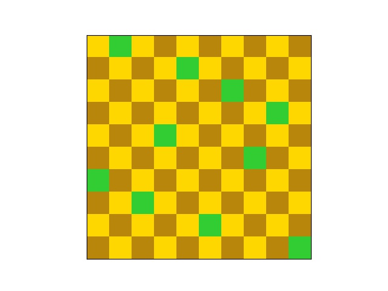
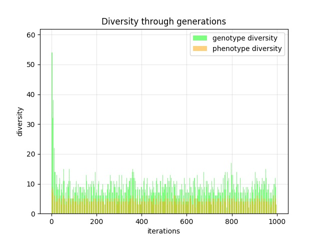

# Genetic N-Queens
Genetic algorithm to solve the n queens problem. The problem arises from a generalization of the eight puzzle:

> _"The eight queen puzzle is the problem of placing eight chess queens on an 8x8 board chessboard so that no two queens threaten each other."_ — From [Wikipedia](https://en.wikipedia.org/wiki/Eight_queens_puzzle)

<p align="center">
    
</p>


## Images

<p align="center">
    
  
</p>


## Installation

To install the dependencies, run the following command:

```bash
pip install -r requirements.txt
```


## Usage

Then use the following command to run the genetic algorithm:

```bash
python genetic_nqueens 
```

The parameters of the algorithm can be changed in in `genetic_nqueens/__main__.py`.

